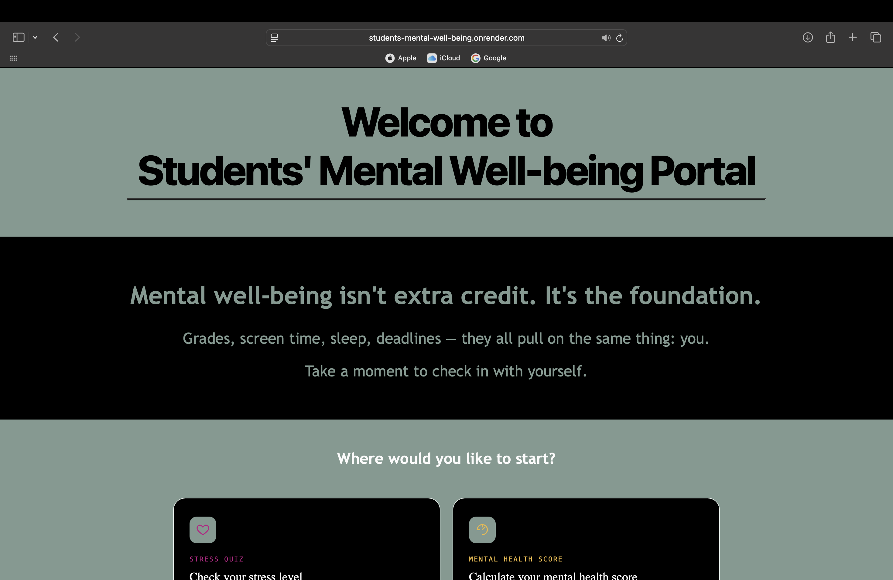
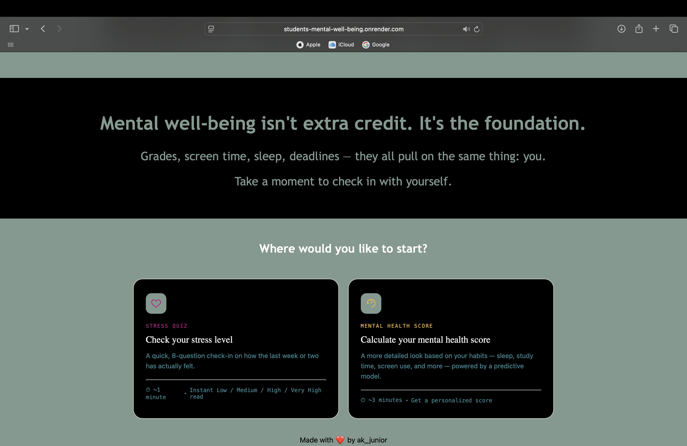
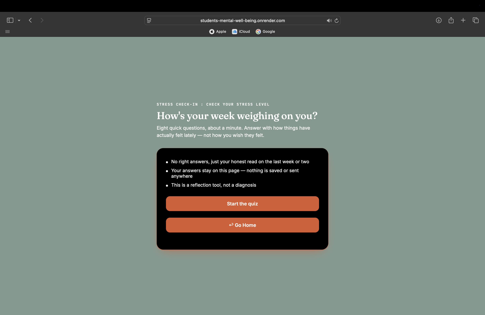
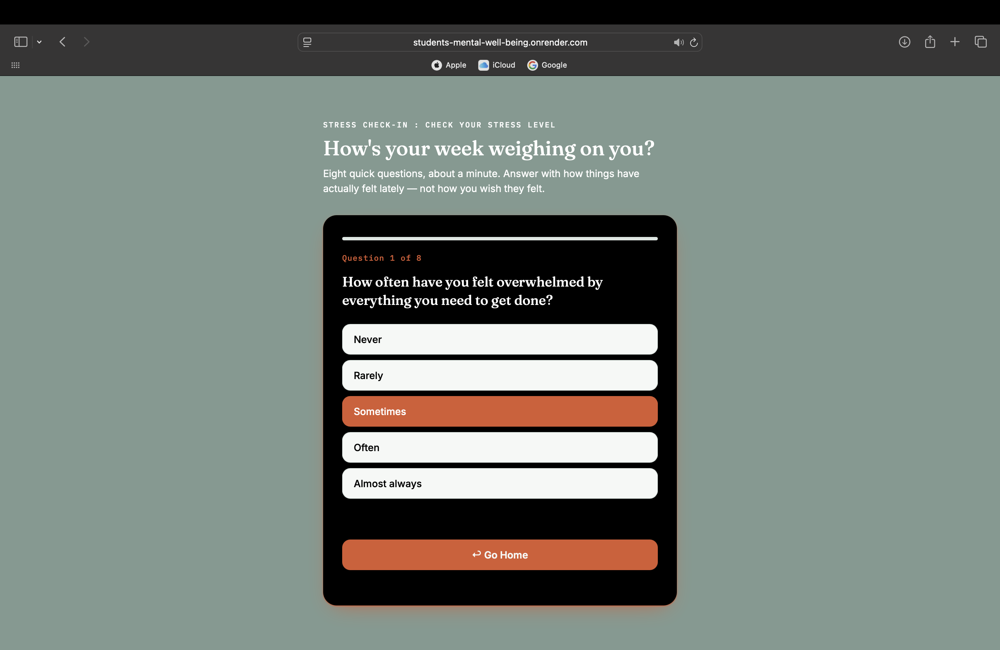
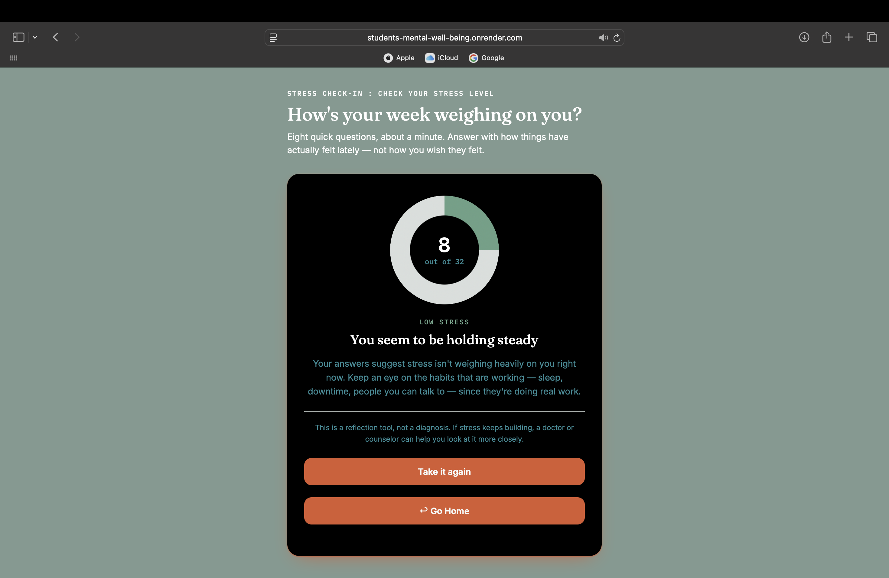
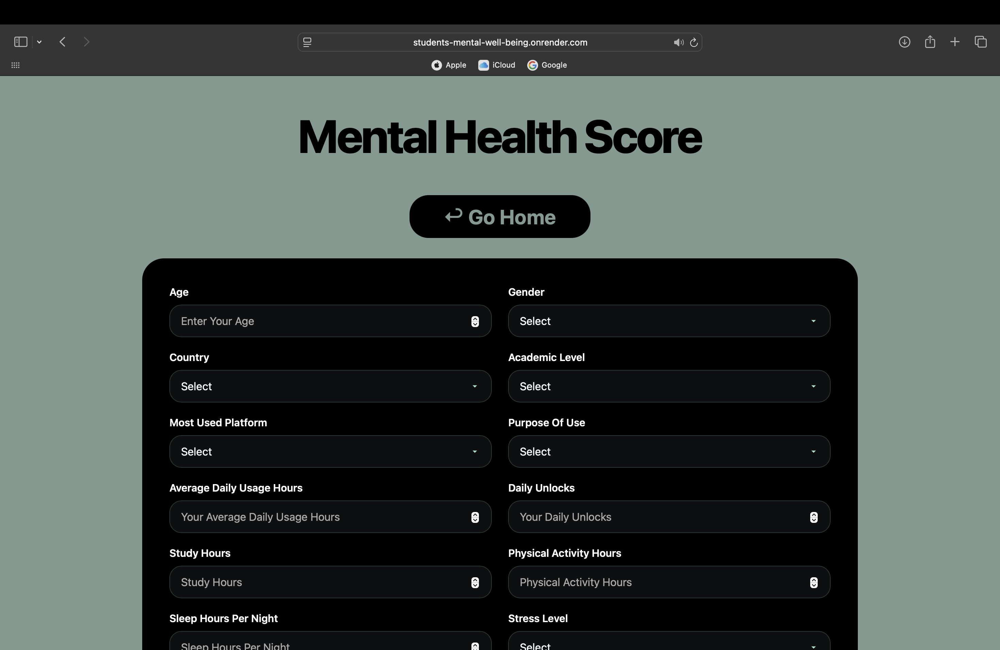
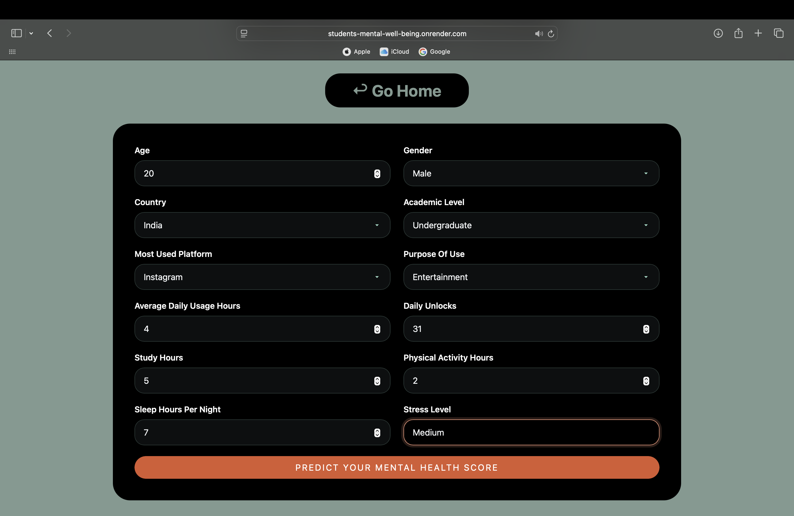
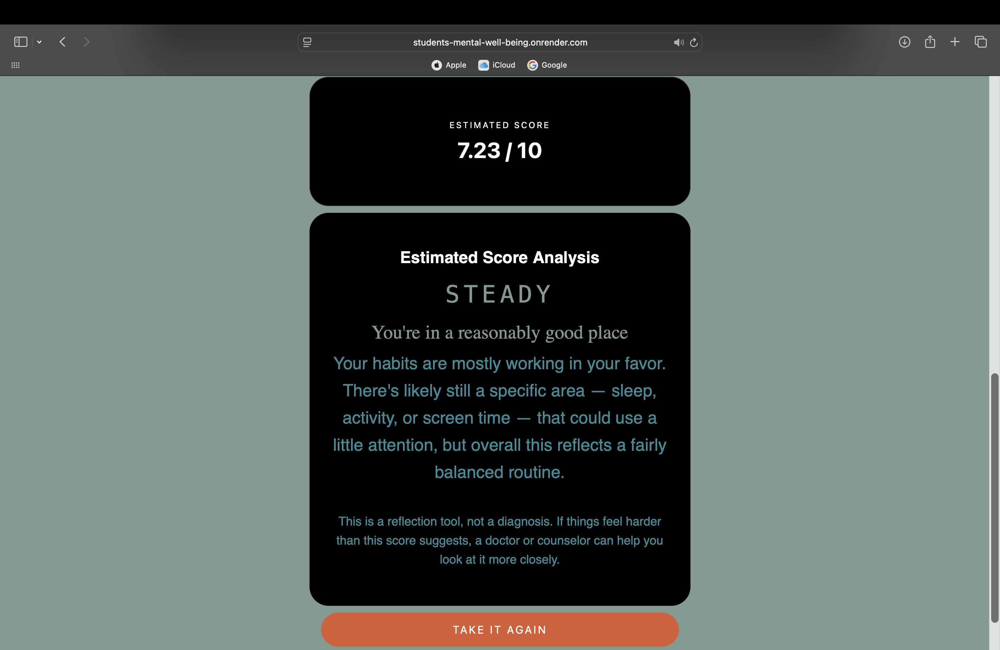

# Students' Mental Well-being Portal

A full-stack machine learning web application that predicts a student's mental health score (0–10) from their social media habits, academic load, sleep, and lifestyle patterns — paired with a self-contained stress-check quiz for instant reflection.

**🔗 Live App:** [students-mental-well-being.onrender.com](https://students-mental-well-being.onrender.com)









---

## Table of Contents

- [Overview](#-overview)
- [Features](#-features)
- [Tech Stack](#-tech-stack)
- [Project Structure](#-project-structure)
- [Dataset](#-dataset)
- [Data Science Pipeline](#-data-science-pipeline)
- [Model Comparison](#-model-comparison)
- [Feature Engineering Details](#-feature-engineering-details)
- [API Reference](#-api-reference)
- [Local Setup](#-local-setup)
- [Deployment](#-deployment-render)
- [Screens](#-screens)
- [Disclaimer](#-disclaimer)
- [Author](#-author)

---

## Overview

Excessive or poorly balanced social media use is one of the most common — and most measurable — stressors in student life. This project turns that idea into a working tool with two complementary paths:

1. **Mental Health Score Predictor** — a regression model trained on 12 lifestyle and social-media features that outputs a score from 0–10, along with a plain-language interpretation of what that score means.
2. **Stress Check-in Quiz** — an 8-question, client-side reflection quiz (no model required) that gives an instant Low / Medium / High / Very High stress read based on the last week or two.

The whole thing — EDA, feature engineering, model selection, and a production API — was built end-to-end and deployed live on Render.

---

## Features

- 🔮 **ML-powered prediction** via a tuned Voting Regressor (SVR + Random Forest) served through a FastAPI backend
- 🧾 **8-question stress quiz** with a live breathing progress bar, back/forward navigation, and an animated gauge result screen — pure HTML/CSS/JS, no backend round-trip
- 📊 **Score interpretation bands** (Needs Support → Getting By → Steady → Thriving) with tailored guidance and crisis-resource messaging for lower scores
- 🌐 **REST API** with typed request/response validation via Pydantic
- 📱 **Responsive UI** across all three pages (home, quiz, predictor)
- ⚡ **Server-rendered pages** via Jinja2 templates, static assets served through FastAPI's `StaticFiles`

---

## Tech Stack

| Layer | Technology |
|---|---|
| **Backend** | FastAPI, Uvicorn |
| **ML / Data** | scikit-learn, pandas, NumPy |
| **Validation** | Pydantic |
| **Templating** | Jinja2 |
| **Frontend** | HTML5, CSS3, vanilla JavaScript |
| **Model Serialization** | pickle |
| **Notebook Environment** | Jupyter |
| **EDA / Visualization** | seaborn, matplotlib |
| **Deployment** | Render (Web Service) |

---

## Project Structure

```
students-mental-wellbeing/
├── main.py                          # FastAPI application & API routes
├── model.pkl                        # Serialized Voting Regressor pipeline
├── requirements.txt
├── templates/
│   ├── home.html                    # Landing page — routes to quiz or predictor
│   ├── index.html                   # Mental Health Score prediction form
│   └── quiz.html                    # 8-question stress check-in quiz
├── static/
│   └── style.css                    # Shared styling for home/predictor pages
├── EDA_Cleaning_Engineering.ipynb   # Data cleaning + feature engineering
├── LinearRegression.ipynb
├── Lasso_Ridge_Regression.ipynb
├── RandomForest.ipynb
├── SVR.ipynb
├── XGBoost.ipynb
├── Voting_Regressor.ipynb           # Final production model
├── Model_Evaluation.ipynb           # Side-by-side model comparison
└── Final_Model.ipynb                # Final pipeline export → model.pkl
```

---

## Dataset

**Source file:** `Student Social Media And Mental Health Impact.csv`

Each row represents one student, with the following raw fields:

| Feature | Type | Description |
|---|---|---|
| `Age` | Numeric | Student age (predominantly 18–24) |
| `Gender` | Categorical | Male / Female |
| `Country` | Categorical | Student's country |
| `Academic_Level` | Ordinal | High School / Undergraduate / Graduate |
| `Most_Used_Platform` | Categorical | Facebook, Instagram, TikTok, WhatsApp, etc. (12 platforms) |
| `Purpose_Of_Use` | Categorical | Networking / Education / Entertainment / News |
| `Avg_Daily_Usage_Hours` | Numeric | Average daily social media usage |
| `Daily_Unlocks` | Numeric | Number of phone unlocks per day |
| `Study_Hours` | Numeric | Daily study time |
| `Physical_Activity_Hours` | Numeric | Daily physical activity |
| `Sleep_Hours_Per_Night` | Numeric | Nightly sleep duration |
| `Stress_Level` | Ordinal | Low / Medium / High / Very High |
| `Mental_Health_Score` | Numeric (target) | 0–10 self-reported well-being score |

### Data Quality Findings (EDA)
- No missing values across any column
- 2 duplicate rows found and removed
- `Physical_Activity_Hours` contained invalid negative values (physically impossible for a time unit) — clipped to a minimum of 0
- `Study_Hours` was the only heavily right-skewed feature and was log-transformed
- `Country` had a long tail of low-frequency values — countries with ≤10 occurrences were grouped into an `"Other"` bucket to prevent overfitting from rare categories
- Outliers detected via IQR in `Study_Hours` (0.4%) and `Physical_Activity_Hours` (0.44%) — left untouched due to negligible volume

---

## Data Science Pipeline

### 1. EDA & Cleaning (`EDA_Cleaning_Engineering.ipynb`)
- Univariate distribution analysis (histograms + skew) for every numeric feature
- Bivariate analysis against the target (`Mental_Health_Score`) via scatter/violin plots
- Correlation heatmap across numeric features
- Category-frequency analysis for all categorical columns
- Cleaning: duplicate removal, negative-value clipping, rare-country consolidation
- Output: `cleaned_engineered.csv`, used as the single source of truth for every downstream model notebook

### 2. Preprocessing Pipeline (identical across all models)

A `ColumnTransformer` handles four distinct feature groups:

```python
skew_num  = ['Study_Hours']                                            # log1p + StandardScaler
other_num = ['Age','Avg_Daily_Usage_Hours','Daily_Unlocks',
             'Physical_Activity_Hours','Sleep_Hours_Per_Night']        # StandardScaler
ord_cat   = ['Stress_Level','Academic_Level']                          # OrdinalEncoder (ranked)
ohe_cat   = ['Gender','Country','Most_Used_Platform','Purpose_Of_Use'] # OneHotEncoder (drop='first')
```

- **Skewed numeric** → `log1p` transform + standard scaling
- **Plain numeric** → standard scaling only
- **Ordinal categorical** → explicitly ranked encoding (`Low < Medium < High < Very High`, `High School < Undergraduate < Graduate`)
- **Nominal categorical** → one-hot encoding with `handle_unknown="ignore"` (production-safe against unseen categories) and `drop='first'` (avoids the dummy-variable trap)

### 3. Model Development

Seven candidate models were trained and evaluated on an identical 80/20 train-test split (`random_state=42`) with 5-fold cross-validation:

| Notebook | Model | Hyperparameter Tuning |
|---|---|---|
| `LinearRegression.ipynb` | Linear Regression | Baseline, no tuning |
| `Lasso_Ridge_Regression.ipynb` | Ridge & Lasso Regression | `GridSearchCV` over `alpha` |
| `RandomForest.ipynb` | Random Forest Regressor | `GridSearchCV` over `n_estimators`, `max_depth`, `min_samples_split/leaf`, `max_features` |
| `SVR.ipynb` | Support Vector Regression | `GridSearchCV` over `C`, `epsilon`, `gamma` |
| `XGBoost.ipynb` | XGBoost Regressor | `GridSearchCV` over `n_estimators`, `learning_rate`, `max_depth`, `min_child_weight`, `colsample_bytree` |
| `Voting_Regressor.ipynb` | **Voting Regressor (SVR + Random Forest)** | Combines tuned SVR (`C=10, epsilon=0.1, gamma=0.1`) with Random Forest via soft voting |
| `Model_Evaluation.ipynb` | — | Consolidated comparison across all 7 models |

---

## Model Comparison

| Model | CV R² | Train R² | Test R² | Test MAE | Test RMSE |
|---|:---:|:---:|:---:|:---:|:---:|
| Linear Regression | 0.7714 | 0.7726 | 0.7844 | 0.4865 | 0.6203 |
| Ridge Regression | 0.7715 | 0.7725 | 0.7842 | 0.4874 | 0.6205 |
| Lasso Regression | 0.7716 | 0.7726 | 0.7845 | 0.4864 | 0.6201 |
| Support Vector Regression | 0.8798 | 0.9508 | 0.8985 | 0.2931 | 0.4256 |
| Random Forest Regression | 0.9162 | 0.9870 | 0.9178 | 0.2768 | 0.3830 |
| XGBoost Regression | 0.9101 | 0.9717 | 0.9083 | 0.2975 | 0.4045 |
| **Voting Regressor** ⭐ | **0.9265** | 0.9756 | **0.9195** | **0.2712** | **0.3790** |

**Why the Voting Regressor won:**
- Highest cross-validated R² (0.9265) — the most reliable indicator of generalization
- Best test-set R², lowest MAE, and lowest RMSE of all seven candidates
- Combines SVR's strong performance on smoother, non-linear relationships with Random Forest's robustness to feature interactions and noisy splits
- Train R² (0.9756) sits close to test R² (0.9195), indicating good generalization without the severe overfitting Random Forest showed on its own (Train 0.987 vs Test 0.918 — a larger gap)

The final model was exported via `pickle` in `Final_Model.ipynb` as `model.pkl` and is loaded directly by the FastAPI backend at startup.

---

## Feature Engineering Details

- **Ordinal encoding is rank-aware**, not arbitrary — `Stress_Level` and `Academic_Level` are encoded with an explicit category order so the model can learn a monotonic relationship rather than treating them as unordered classes.
- **`handle_unknown="ignore"`** on the one-hot encoder means the API won't crash if a user selects a country or platform outside the training set's top categories — it degrades gracefully to an all-zero encoding instead of raising an error.
- **Log-transforming only `Study_Hours`** (rather than all numeric features) was a deliberate choice based on the skew analysis in EDA — over-transforming well-behaved features can hurt model interpretability and performance for no benefit.

---

## API Reference

### `GET /`
Renders the landing page (`home.html`).

### `GET /predict-home`
Renders the prediction form (`index.html`).

### `GET /stress-quiz`
Renders the standalone stress quiz (`quiz.html`).

### `GET /health`
Simple liveness check.
```json
{ "status": "ok" }
```

### `POST /predict`
Runs the trained model on submitted lifestyle data and returns a predicted score.

**Request body:**
```json
{
  "age": 21,
  "gender": "Female",
  "country": "India",
  "academic_level": "Undergraduate",
  "most_used_platform": "Instagram",
  "purpose_of_use": "Entertainment",
  "avg_daily_usage_hours": 4.5,
  "daily_unlocks": 80,
  "study_hours": 3,
  "physical_activity_hours": 1,
  "sleep_hours_per_night": 6.5,
  "stress_level": "High"
}
```

**Response:**
```json
{ "predicted_mental_health_score": 5.42 }
```

All fields are validated server-side with Pydantic (`Literal` types for enums, bounded ranges for numeric fields) — invalid input returns a `422` with detailed validation errors instead of a silent failure or crash.

---

## Local Setup

```bash
# 1. Clone the repo
git clone https://github.com/<your-username>/students-mental-wellbeing.git
cd students-mental-wellbeing

# 2. Create a virtual environment
python -m venv venv
source venv/bin/activate        # Windows: venv\Scripts\activate

# 3. Install dependencies
pip install -r requirements.txt

# 4. Run the app
uvicorn main:app --reload

# 5. Open in browser
# http://127.0.0.1:8000
```

**`requirements.txt`**
```txt
fastapi
uvicorn[standard]
pandas
numpy
scikit-learn
pydantic
jinja2
python-multipart
```
> Pin `scikit-learn` to the exact version used to train `model.pkl` — a version mismatch between training and serving environments is the most common cause of pickle-loading errors in production.

---

## Deployment (Render)

The app is deployed as a **Render Web Service**, built directly from this GitHub repository.

| Setting | Value |
|---|---|
| Environment | Python 3 |
| Build Command | `pip install -r requirements.txt` |
| Start Command | `uvicorn main:app --host 0.0.0.0 --port $PORT` |
| Instance Type | Free |

**Live URL:** [https://students-mental-well-being.onrender.com](https://students-mental-well-being.onrender.com)

> Note: on Render's free tier, the service spins down after inactivity — the first request after idle time may take 30–50 seconds to wake up.

---

## Screens

| Page | Purpose |
|---|---|
| **Home** | Entry point — choose between the quick stress quiz or the detailed ML score |
| **Stress Quiz** | 8-question client-side reflection tool with an animated gauge result |
| **Score Predictor** | Full lifestyle form → ML-predicted score (0–10) with a personalized interpretation band |

---

## Disclaimer

This project is a **reflection and awareness tool, not a diagnostic instrument**. Predictions and quiz results are based on statistical patterns in survey data and should not be used as a substitute for professional medical or psychological advice. If you or someone you know is struggling, please reach out to a counselor, doctor, or a crisis line in your area.

---

## Author


**Aishwarya Kumar Singh**

GitHub: https://github.com/ak-junior3339


## License

This project is licensed under the MIT License — free to use, modify, and distribute.
---

⭐ If you found this project helpful, consider giving it a **Star** on GitHub!